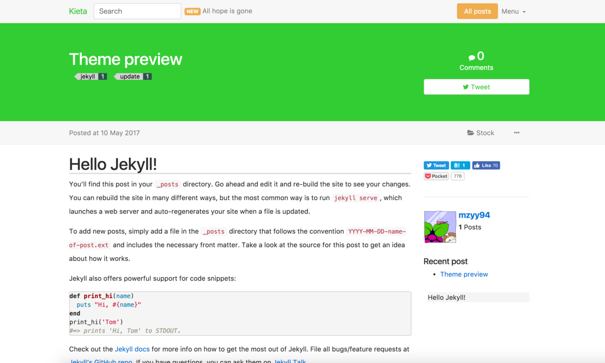

# jekyll-kieta-theme

**Clean knowledge sharing jekyll theme**


---


## Installation

Download newest release from [release](https://github.com/mzyy94/jekyll-kieta-theme/releases) page.
Extract and get all files from there.

And add these lines to your Jekyll site's `_config.yml`:

```yaml
subtitle: All hope is gone
author: YOUR_NAME_OR_ID
github:
  username: YOUR_GITHUB_ID
twitter:
  username: YOUR_TWITTER_ID
disqus: YOUR_DISQUS_SHORTNAME
color: limegreen

permalink: /items/:title
search_engine: https://www.google.com/search
paginate: 5 
paginate_path: "/page/:num"
jekyll-mentions: https://twitter.com
feed:
  path: /atom.xml

exclude:
  - Gemfile
  - Gemfile.lock
gems:
  - jekyll-avatar
  - jekyll-paginate
  - jekyll-seo-tag
  - jekyll-mentions
  - jekyll-sitemap
  - jemoji
  - jekyll-feed
  # Add more you want
markdown: kramdown
kramdown:
  auto_ids:       true
  entity_output:  as_char
  toc_levels:     1..6
  smart_quotes:   lsquo,rsquo,ldquo,rdquo
  input:          GFM
  hard_wrap:      true
  footnote_nr:    1
```

## Usage

Create posts or some independed pages.

## Contributing

Bug reports and pull requests are welcome on GitHub at https://github.com/[USERNAME]/hello. This project is intended to be a safe, welcoming space for collaboration, and contributors are expected to adhere to the [Contributor Covenant](http://contributor-covenant.org) code of conduct.

## Development

To set up your environment to develop this theme, run `bundle install`.

Your theme is setup just like a normal Jekyll site! To test your theme, run `bundle exec jekyll serve` and open your browser at `http://localhost:4000`. This starts a Jekyll server using your theme. Add pages, documents, data, etc. like normal to test your theme's contents. As you make modifications to your theme and to your content, your site will regenerate and you should see the changes in the browser after a refresh, just like normal.

When your theme is released, only the files in `_layouts`, `_includes`, and `_sass` tracked with Git will be released.

## License

The theme is available as open source under the terms of the [MIT License](https://opensource.org/licenses/MIT).

